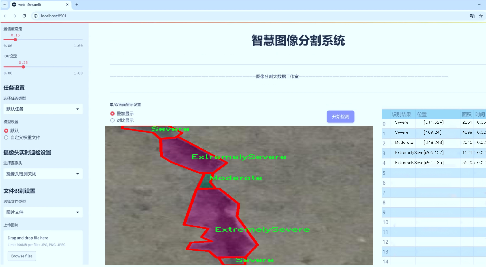

# 混凝土裂缝类型严重程度图像分割系统源码＆数据集分享
 [yolov8-seg-aux＆yolov8-seg-p6等50+全套改进创新点发刊_一键训练教程_Web前端展示]

### 1.研究背景与意义

项目参考[ILSVRC ImageNet Large Scale Visual Recognition Challenge](https://gitee.com/YOLOv8_YOLOv11_Segmentation_Studio/projects)

项目来源[AAAI Global Al lnnovation Contest](https://kdocs.cn/l/cszuIiCKVNis)

研究背景与意义

随着城市化进程的加快，基础设施的建设与维护变得愈发重要，尤其是混凝土结构的安全性与耐久性问题日益受到关注。混凝土作为一种广泛应用于建筑和工程领域的材料，其裂缝的产生不仅影响结构的美观，更可能导致严重的安全隐患。因此，及时、准确地检测和评估混凝土裂缝的类型及其严重程度，对于确保建筑物的安全性和延长其使用寿命具有重要意义。

传统的混凝土裂缝检测方法主要依赖人工目测或简单的图像处理技术，这些方法不仅耗时耗力，而且容易受到主观因素的影响，导致检测结果的不准确性。近年来，随着计算机视觉和深度学习技术的快速发展，基于图像的自动化裂缝检测方法逐渐成为研究热点。其中，YOLO（You Only Look Once）系列模型因其高效的实时检测能力和良好的精度，广泛应用于目标检测任务。然而，YOLOv8作为该系列的最新版本，虽然在目标检测上表现出色，但在混凝土裂缝的细粒度分割和严重程度分类方面仍存在一定的局限性。

本研究旨在基于改进的YOLOv8模型，构建一个混凝土裂缝类型严重程度图像分割系统。该系统将利用一个包含1100张图像的数据集，该数据集涵盖了三种裂缝严重程度的类别：极其严重（Extremely Severe）、严重（Severe）和中等（Moderate）。通过对这些图像进行实例分割，系统不仅能够识别出裂缝的存在，还能对其进行精确的分类和定位，从而为后续的维修和加固提供科学依据。

在研究过程中，我们将对YOLOv8模型进行改进，以提高其在裂缝检测任务中的表现。这包括优化网络结构、调整损失函数以及增强数据集的多样性等。通过这些改进，我们期望能够提高模型对不同类型裂缝的识别能力，特别是在复杂背景和不同光照条件下的表现。此外，利用实例分割技术，我们能够获得裂缝的精确轮廓，这对于后续的裂缝分析和评估至关重要。

本研究的意义不仅在于推动混凝土裂缝检测技术的发展，更在于为基础设施的安全管理提供有效的技术支持。通过实现自动化的裂缝检测与评估，我们能够大幅提高检测效率，降低人工成本，同时减少因人为因素导致的误判。此外，该系统的应用将有助于实现建筑物的智能化管理，推动智慧城市的建设。

综上所述，基于改进YOLOv8的混凝土裂缝类型严重程度图像分割系统的研究，具有重要的理论价值和实际应用意义。它不仅为混凝土裂缝检测提供了一种新的解决方案，也为相关领域的研究提供了新的思路和方法。随着研究的深入，我们期待该系统能够在实际工程中发挥重要作用，为基础设施的安全与维护提供坚实的技术保障。

### 2.图片演示




##### 注意：由于此博客编辑较早，上面“2.图片演示”和“3.视频演示”展示的系统图片或者视频可能为老版本，新版本在老版本的基础上升级如下：（实际效果以升级的新版本为准）

  （1）适配了YOLOV8的“目标检测”模型和“实例分割”模型，通过加载相应的权重（.pt）文件即可自适应加载模型。

  （2）支持“图片识别”、“视频识别”、“摄像头实时识别”三种识别模式。

  （3）支持“图片识别”、“视频识别”、“摄像头实时识别”三种识别结果保存导出，解决手动导出（容易卡顿出现爆内存）存在的问题，识别完自动保存结果并导出到tempDir中。

  （4）支持Web前端系统中的标题、背景图等自定义修改，后面提供修改教程。

  另外本项目提供训练的数据集和训练教程,暂不提供权重文件（best.pt）,需要您按照教程进行训练后实现图片演示和Web前端界面演示的效果。

### 3.视频演示

[3.1 视频演示](https://www.bilibili.com/video/BV1fD2tYvEok/)

### 4.数据集信息展示

##### 4.1 本项目数据集详细数据（类别数＆类别名）

nc: 3
names: ['ExtremelySevere', 'Moderate', 'Severe']


##### 4.2 本项目数据集信息介绍

数据集信息展示

在现代建筑工程中，混凝土裂缝的检测与评估是确保结构安全和延长使用寿命的重要环节。为了有效地识别和分类不同类型的混凝土裂缝，本文所使用的数据集“Crack_seg”被精心构建，以支持改进YOLOv8-seg的图像分割系统。该数据集的设计旨在为机器学习模型提供丰富的训练样本，从而提高其在实际应用中的准确性和可靠性。

“Crack_seg”数据集包含三种裂缝严重程度的类别，分别为“ExtremelySevere”（极其严重）、“Moderate”（中等）和“Severe”（严重）。这三类裂缝的划分不仅反映了裂缝的外观特征，还与其对混凝土结构的潜在影响密切相关。极其严重的裂缝通常伴随着明显的结构损伤，可能导致安全隐患；而中等和严重的裂缝则需要及时的维护和修复，以防止进一步恶化。因此，准确识别和分类这些裂缝对于制定有效的维修策略至关重要。

在数据集的构建过程中，研究团队采集了大量的混凝土裂缝图像，确保涵盖不同环境、不同光照条件以及不同表面状态下的裂缝样本。这些图像经过精细标注，确保每一张图像都能准确地反映其对应的裂缝类型和严重程度。通过这种方式，数据集不仅为模型的训练提供了丰富的样本，还增强了模型在多样化场景下的泛化能力。

此外，数据集中的图像分辨率和质量也经过严格控制，以确保模型在训练过程中能够提取到有效的特征信息。每一类裂缝的样本数量均衡，避免了因样本不均而导致的模型偏差。这种均衡性在一定程度上提升了模型对不同裂缝类型的识别能力，使其在实际应用中能够更好地适应各种情况。

在训练过程中，改进YOLOv8-seg模型将利用“Crack_seg”数据集进行深度学习，旨在通过卷积神经网络（CNN）提取图像特征，并通过图像分割技术实现对裂缝的精准定位和分类。该模型的设计理念是通过高效的特征提取和分类算法，提升裂缝检测的自动化水平，降低人工检测的工作量和误差率。

总之，“Crack_seg”数据集为混凝土裂缝类型和严重程度的图像分割提供了坚实的基础。通过对该数据集的深入研究和应用，改进YOLOv8-seg模型有望在混凝土结构的健康监测领域取得显著进展，为建筑安全提供更为可靠的保障。随着数据集的不断扩展和优化，未来的研究将能够进一步提升裂缝检测的精度和效率，为建筑工程的维护和管理提供更加科学的数据支持。


### 5.全套项目环境部署视频教程（零基础手把手教学）

[5.1 环境部署教程链接（零基础手把手教学）](https://www.bilibili.com/video/BV1jG4Ve4E9t/?vd_source=bc9aec86d164b67a7004b996143742dc)


[5.2 安装Python虚拟环境创建和依赖库安装视频教程链接（零基础手把手教学）](https://www.bilibili.com/video/BV1nA4VeYEze/?vd_source=bc9aec86d164b67a7004b996143742dc)

### 6.手把手YOLOV8-seg训练视频教程（零基础小白有手就能学会）

[6.1 手把手YOLOV8-seg训练视频教程（零基础小白有手就能学会）](https://www.bilibili.com/video/BV1cA4VeYETe/?vd_source=bc9aec86d164b67a7004b996143742dc)


按照上面的训练视频教程链接加载项目提供的数据集，运行train.py即可开始训练



     Epoch   gpu_mem       box       obj       cls    labels  img_size
     1/200     0G   0.01576   0.01955  0.007536        22      1280: 100%|██████████| 849/849 [14:42<00:00,  1.04s/it]
               Class     Images     Labels          P          R     mAP@.5 mAP@.5:.95: 100%|██████████| 213/213 [01:14<00:00,  2.87it/s]
                 all       3395      17314      0.994      0.957      0.0957      0.0843

     Epoch   gpu_mem       box       obj       cls    labels  img_size
     2/200     0G   0.01578   0.01923  0.007006        22      1280: 100%|██████████| 849/849 [14:44<00:00,  1.04s/it]
               Class     Images     Labels          P          R     mAP@.5 mAP@.5:.95: 100%|██████████| 213/213 [01:12<00:00,  2.95it/s]
                 all       3395      17314      0.996      0.956      0.0957      0.0845

     Epoch   gpu_mem       box       obj       cls    labels  img_size
     3/200     0G   0.01561    0.0191  0.006895        27      1280: 100%|██████████| 849/849 [10:56<00:00,  1.29it/s]
               Class     Images     Labels          P          R     mAP@.5 mAP@.5:.95: 100%|███████   | 187/213 [00:52<00:00,  4.04it/s]
                 all       3395      17314      0.996      0.957      0.0957      0.0845


### 7.50+种全套YOLOV8-seg创新点代码加载调参视频教程（一键加载写好的改进模型的配置文件）

[7.1 50+种全套YOLOV8-seg创新点代码加载调参视频教程（一键加载写好的改进模型的配置文件）](https://www.bilibili.com/video/BV1Hw4VePEXv/?vd_source=bc9aec86d164b67a7004b996143742dc)

### 8.YOLOV8-seg图像分割算法原理

原始YOLOV8-seg算法原理

YOLOV8-seg算法是YOLO系列目标检测算法的最新版本，结合了目标检测与图像分割的能力，展现出更高的检测精度和更快的处理速度。该算法的设计理念在于通过高效的特征提取和融合机制，提升对复杂场景中目标的识别与分割能力。YOLOV8-seg不仅延续了YOLO系列的单阶段检测框架，还在网络结构和损失函数上进行了多项创新，以适应更为复杂的视觉任务。

首先，YOLOV8-seg的网络结构可以分为三个主要部分：Backbone、Neck和Head。Backbone部分负责从输入图像中提取特征，采用了一系列卷积和反卷积层。为了提高特征提取的效率，YOLOV8-seg引入了C2模块作为基本构成单元，利用残差连接和瓶颈结构来减小网络的参数量，同时保持高性能。该部分由5个CBS模块、4个C2f模块和1个快速空间金字塔池化(SPPF)模块组成。SPPF模块通过不同内核尺寸的池化操作，有效地合并了特征图，从而增强了网络对多尺度目标的感知能力。

接下来，Neck部分采用了多尺度特征融合技术，旨在将来自Backbone不同阶段的特征图进行融合，以便更好地捕捉不同尺度目标的信息。这一过程不仅提升了目标检测的性能，还增强了算法的鲁棒性。Neck部分的设计基于“双塔结构”，结合了特征金字塔和路径聚合网络，促进了语义特征与定位特征的有效转移，进一步巩固了网络特征融合的能力。通过这种方式，YOLOV8-seg能够在处理复杂场景时，获取更丰富的特征信息，从而提升对不同尺度目标的检测性能。

最后，Head部分负责最终的目标检测和分类任务。YOLOV8-seg设有三个检测头，分别用于处理不同尺寸的信息。这些检测头包含一系列卷积层和反卷积层，能够生成最终的检测结果。值得注意的是，YOLOV8-seg采用了解耦头的结构，将回归分支和预测分支进行分离，这一设计不仅加速了模型的收敛速度，还提高了检测的准确性。此外，YOLOV8-seg在损失函数的设计上也进行了创新，采用了变焦损失来计算分类损失，并引入数据平均保真度损失和完美交并比损失来计算边界框损失。这种新的损失策略使得YOLOV8-seg在目标检测中能够更加精准地进行目标定位与分类。

YOLOV8-seg的另一个显著特点是其灵活性和可扩展性。该算法支持多种网络结构的选择，包括YOLOv8n、YOLOv8s、YOLOv8m、YOLOv8l和YOLOv8x等，用户可以根据具体应用场景的需求，选择合适的网络结构。这些不同的网络结构在Backbone的层数和残差块的数量上有所区别，但基本原理保持一致，确保了算法在不同条件下的适应性和效率。

在实际应用中，YOLOV8-seg展现出了极高的实用价值。其高效的特征提取和融合能力，使得算法能够在复杂的视觉环境中，快速而准确地进行目标检测与分割。这一特性使得YOLOV8-seg在自动驾驶、智能监控、医疗影像分析等领域都有着广泛的应用前景。

综上所述，YOLOV8-seg算法通过对网络结构的优化和损失函数的创新，提升了目标检测与分割的性能。其高效的特征提取机制和灵活的网络结构选择，使得YOLOV8-seg在处理复杂视觉任务时，能够保持高精度和高速度的优势。这些特性不仅推动了目标检测技术的发展，也为未来的计算机视觉应用提供了更为强大的工具。随着YOLOV8-seg的不断优化与迭代，预计将在更多领域展现出其独特的价值和潜力。


### 9.系统功能展示（检测对象为举例，实际内容以本项目数据集为准）

图9.1.系统支持检测结果表格显示

  图9.2.系统支持置信度和IOU阈值手动调节

  图9.3.系统支持自定义加载权重文件best.pt(需要你通过步骤5中训练获得)

  图9.4.系统支持摄像头实时识别

  图9.5.系统支持图片识别

  图9.6.系统支持视频识别

  图9.7.系统支持识别结果文件自动保存

  图9.8.系统支持Excel导出检测结果数据


### 10.50+种全套YOLOV8-seg创新点原理讲解（非科班也可以轻松写刊发刊，V11版本正在科研待更新）

#### 10.1 由于篇幅限制，每个创新点的具体原理讲解就不一一展开，具体见下列网址中的创新点对应子项目的技术原理博客网址【Blog】：


[10.1 50+种全套YOLOV8-seg创新点原理讲解链接](https://gitee.com/qunmasj/good)

#### 10.2 部分改进模块原理讲解(完整的改进原理见上图和技术博客链接)【如果此小节的图加载失败可以通过CSDN或者Github搜索该博客的标题访问原始博客，原始博客图片显示正常】
### YOLOv8算法原理
YOLOv8算法由Glenn-Jocher 提出，是跟YOLOv3算法、YOLOv5算法一脉相承的，主要的改进点如下:
(1)数据预处理。YOLOv8的数据预处理依旧采用YOLOv5的策略,在训练时，主要采用包括马赛克增强(Mosaic)、混合增强(Mixup)、空间扰动(randomperspective)以及颜色扰动(HSV augment)四个增强手段。
(2)骨干网络结构。YOLOv8的骨干网络结构可从YOLOv5略见一斑，YOLOv5的主干网络的架构规律十分清晰，总体来看就是每用一层步长为2的3×3卷积去降采样特征图，接一个C3模块来进一步强化其中的特征，且C3的基本深度参数分别为“3/6/9/3”，其会根据不同规模的模型的来做相应的缩放。在的YOLOv8中，大体上也还是继承了这一特点，原先的C3模块均被替换成了新的C2f模块，C2f 模块加入更多的分支，丰富梯度回传时的支流。下面展示了YOLOv8的C2f模块和YOLOv5的C3模块，其网络结构图所示。


(3)FPN-PAN结构。YOLOv8仍采用FPN+PAN结构来构建YOLO的特征金字塔，使多尺度信息之间进行充分的融合。除了FPN-PAN里面的C3模块被替换为C2f模块外，其余部分与YOLOv5的FPN-PAN结构基本一致。
(4)Detection head结构。从 YOLOv3到 YOLOv5，其检测头一直都是“耦合”(Coupled)的,即使用一层卷积同时完成分类和定位两个任务，直到YOLOX的问世， YOLO系列才第一次换装“解耦头”(Decoupled Head)。YOLOv8也同样也采用了解耦头的结构，两条并行的分支分别取提取类别特征和位置特征，然后各用一层1x1卷积完成分类和定位任务。YOLOv8整体的网络结构由图所示。


(5)标签分配策略。尽管YOLOv5设计了自动聚类候选框的一些功能，但是聚类候选框是依赖于数据集的。若数据集不够充分，无法较为准确地反映数据本身的分布特征，聚类出来的候选框也会与真实物体尺寸比例悬殊过大。YOLOv8没有采用候选框策略，所以解决的问题就是正负样本匹配的多尺度分配。不同于YOLOX所使用的 SimOTA，YOLOv8在标签分配问题上采用了和YOLOv6相同的TOOD策略，是一种动态标签分配策略。YOLOv8只用到了targetboze。和target scores，未含是否有物体预测，故 YOLOv8的损失就主要包括两大部分∶类别损失和位置损失。对于YOLOv8，其分类损失为VFLLoss(Varifocal Loss)，其回归损失为CIoU Loss 与 DFL Loss 的形式。
其中 Varifocal Loss定义如下:


其中p为预测的类别得分，p ∈ [0.1]。q为预测的目标分数(若为真实类别，则q为预测和真值的 loU;若为其他类别。q为0 )。VFL Loss使用不对称参数来对正负样本进行加权，通过只对负样本进行衰减，达到不对等的处理前景和背景对损失的贡献。对正样本，使用q进行了加权，如果正样本的GTiou很高时,则对损失的贡献更大一些，可以让网络聚焦于那些高质量的样本上，即训练高质量的正例对AP的提升比低质量的更大一些。对负样本，使用p进行了降权，降低了负例对损失的贡献，因负样本的预测p在取次幂后会变得更小，这样就能够降低负样本对损失的整体贡献。

### 动态蛇形卷积Dynamic Snake Convolution

参考论文： 2307.08388.pdf (arxiv.org)

血管、道路等拓扑管状结构的精确分割在各个领域都至关重要，确保下游任务的准确性和效率。 然而，许多因素使任务变得复杂，包括薄的局部结构和可变的全局形态。在这项工作中，我们注意到管状结构的特殊性，并利用这些知识来指导我们的 DSCNet 在三个阶段同时增强感知：特征提取、特征融合、 和损失约束。 首先，我们提出了一种动态蛇卷积，通过自适应地关注细长和曲折的局部结构来准确捕获管状结构的特征。 随后，我们提出了一种多视图特征融合策略，以补充特征融合过程中多角度对特征的关注，确保保留来自不同全局形态的重要信息。 最后，提出了一种基于持久同源性的连续性约束损失函数，以更好地约束分割的拓扑连续性。 2D 和 3D 数据集上的实验表明，与多种方法相比，我们的 DSCNet 在管状结构分割任务上提供了更好的准确性和连续性。 我们的代码是公开的。 
主要的挑战源于细长微弱的局部结构特征与复杂多变的全局形态特征。本文关注到管状结构细长连续的特点，并利用这一信息在神经网络以下三个阶段同时增强感知：特征提取、特征融合和损失约束。分别设计了动态蛇形卷积（Dynamic Snake Convolution），多视角特征融合策略与连续性拓扑约束损失。 

我们希望卷积核一方面能够自由地贴合结构学习特征，另一方面能够在约束条件下不偏离目标结构太远。在观察管状结构的细长连续的特征后，脑海里想到了一个动物——蛇。我们希望卷积核能够像蛇一样动态地扭动，来贴合目标的结构。

我们希望卷积核一方面能够自由地贴合结构学习特征，另一方面能够在约束条件下不偏离目标结构太远。在观察管状结构的细长连续的特征后，脑海里想到了一个动物——蛇。我们希望卷积核能够像蛇一样动态地扭动，来贴合目标的结构。


### DCNV2融入YOLOv8
DCN和DCNv2（可变性卷积）
网上关于两篇文章的详细描述已经很多了，我这里具体的细节就不多讲了，只说一下其中实现起来比较困惑的点。（黑体字会讲解）

DCNv1解决的问题就是我们常规的图像增强，仿射变换（线性变换加平移）不能解决的多种形式目标变换的几何变换的问题。如下图所示。

可变性卷积的思想很简单，就是讲原来固定形状的卷积核变成可变的。如下图所示：


首先来看普通卷积，以3x3卷积为例对于每个输出y(p0)，都要从x上采样9个位置，这9个位置都在中心位置x(p0)向四周扩散得到的gird形状上，(-1,-1)代表x(p0)的左上角，(1,1)代表x(p0)的右下角，其他类似。

用公式表示如下：


可变性卷积Deformable Conv操作并没有改变卷积的计算操作，而是在卷积操作的作用区域上，加入了一个可学习的参数∆pn。同样对于每个输出y(p0)，都要从x上采样9个位置，这9个位置是中心位置x(p0)向四周扩散得到的，但是多了 ∆pn，允许采样点扩散成非gird形状。


偏移量是通过对原始特征层进行卷积得到的。比如输入特征层是w×h×c，先对输入的特征层进行卷积操作，得到w×h×2c的offset field。这里的w和h和原始特征层的w和h是一致的，offset field里面的值是输入特征层对应位置的偏移量，偏移量有x和y两个方向，所以offset field的channel数是2c。offset field里的偏移量是卷积得到的，可能是浮点数，所以接下来需要通过双向性插值计算偏移位置的特征值。在偏移量的学习中，梯度是通过双线性插值来进行反向传播的。
看到这里是不是还是有点迷茫呢？那到底程序上面怎么实现呢？


事实上由上面的公式我们可以看得出来∆pn这个偏移量是加在原像素点上的，但是我们怎么样从代码上对原像素点加这个量呢？其实很简单，就是用一个普通的卷积核去跟输入图片（一般是输入的feature_map）卷积就可以了卷积核的数量是2N也就是23*3==18（前9个通道是x方向的偏移量，后9个是y方向的偏移量），然后把这个卷积的结果与正常卷积的结果进行相加就可以了。
然后又有了第二个问题，怎么样反向传播呢？为什么会有这个问题呢？因为求出来的偏移量+正常卷积输出的结果往往是一个浮点数，浮点数是无法对应到原图的像素点的，所以自然就想到了双线性差值的方法求出浮点数对应的浮点像素点。


#### DCN v2
对于positive的样本来说，采样的特征应该focus在RoI内，如果特征中包含了过多超出RoI的内容，那么结果会受到影响和干扰。而negative样本则恰恰相反，引入一些超出RoI的特征有助于帮助网络判别这个区域是背景区域。

DCNv1引入了可变形卷积，能更好的适应目标的几何变换。但是v1可视化结果显示其感受野对应位置超出了目标范围，导致特征不受图像内容影响（理想情况是所有的对应位置分布在目标范围以内）。

为了解决该问题：提出v2, 主要有

1、扩展可变形卷积，增强建模能力
2、提出了特征模拟方案指导网络培训：feature mimicking scheme

上面这段话是什么意思呢，通俗来讲就是，我们的可变性卷积的区域大于目标所在区域，所以这时候就会对非目标区域进行错误识别。

所以自然能想到的解决方案就是加入权重项进行惩罚。（至于这个实现起来就比较简单了，直接初始化一个权重然后乘(input+offsets)就可以了）


可调节的RoIpooling也是类似的，公式如下：


### 11.项目核心源码讲解（再也不用担心看不懂代码逻辑）

#### 11.1 ultralytics\utils\callbacks\neptune.py

以下是经过精简和注释的核心代码部分，主要保留了与NeptuneAI集成相关的功能：

```python
# 导入必要的库
from ultralytics.utils import LOGGER, SETTINGS, TESTS_RUNNING

# 尝试导入NeptuneAI并进行初始化
try:
    assert not TESTS_RUNNING  # 确保不是在pytest测试中
    assert SETTINGS['neptune'] is True  # 确保Neptune集成已启用
    import neptune
    from neptune.types import File

    assert hasattr(neptune, '__version__')  # 确保Neptune版本可用

    run = None  # NeptuneAI实验记录实例

except (ImportError, AssertionError):
    neptune = None  # 如果导入失败，则neptune为None


def _log_scalars(scalars, step=0):
    """将标量数据记录到NeptuneAI实验记录器中。"""
    if run:  # 如果Neptune已初始化
        for k, v in scalars.items():
            run[k].append(value=v, step=step)  # 记录每个标量


def _log_images(imgs_dict, group=''):
    """将图像记录到NeptuneAI实验记录器中。"""
    if run:  # 如果Neptune已初始化
        for k, v in imgs_dict.items():
            run[f'{group}/{k}'].upload(File(v))  # 上传每个图像


def on_pretrain_routine_start(trainer):
    """训练例程开始前的回调函数。"""
    try:
        global run
        # 初始化Neptune运行
        run = neptune.init_run(project=trainer.args.project or 'YOLOv8', name=trainer.args.name, tags=['YOLOv8'])
        # 记录超参数配置
        run['Configuration/Hyperparameters'] = {k: '' if v is None else v for k, v in vars(trainer.args).items()}
    except Exception as e:
        LOGGER.warning(f'WARNING ⚠️ NeptuneAI安装但未正确初始化，未记录此运行。{e}')


def on_train_epoch_end(trainer):
    """每个训练周期结束时的回调函数。"""
    # 记录训练损失和学习率
    _log_scalars(trainer.label_loss_items(trainer.tloss, prefix='train'), trainer.epoch + 1)
    _log_scalars(trainer.lr, trainer.epoch + 1)
    # 在第一个周期结束时记录训练图像
    if trainer.epoch == 1:
        _log_images({f.stem: str(f) for f in trainer.save_dir.glob('train_batch*.jpg')}, 'Mosaic')


def on_val_end(validator):
    """每次验证结束时的回调函数。"""
    if run:
        # 记录验证图像
        _log_images({f.stem: str(f) for f in validator.save_dir.glob('val*.jpg')}, 'Validation')


def on_train_end(trainer):
    """训练结束时的回调函数。"""
    if run:
        # 记录最终结果和模型
        files = [
            'results.png', 'confusion_matrix.png', 'confusion_matrix_normalized.png',
            *(f'{x}_curve.png' for x in ('F1', 'PR', 'P', 'R'))]
        files = [(trainer.save_dir / f) for f in files if (trainer.save_dir / f).exists()]  # 过滤存在的文件
        for f in files:
            _log_plot(title=f.stem, plot_path=f)  # 记录每个图表
        # 记录最终模型
        run[f'weights/{trainer.args.name or trainer.args.task}/{str(trainer.best.name)}'].upload(File(str(trainer.best)))


# 定义回调函数字典，仅在Neptune可用时定义
callbacks = {
    'on_pretrain_routine_start': on_pretrain_routine_start,
    'on_train_epoch_end': on_train_epoch_end,
    'on_val_end': on_val_end,
    'on_train_end': on_train_end
} if neptune else {}
```

### 代码说明：
1. **NeptuneAI集成**：代码尝试导入Neptune库并初始化，如果失败则将`neptune`设置为`None`，以避免后续调用时出错。
2. **日志记录函数**：
   - `_log_scalars`：记录标量数据（如损失和学习率）。
   - `_log_images`：记录图像数据（如训练和验证图像）。
3. **回调函数**：
   - `on_pretrain_routine_start`：在训练开始前初始化Neptune运行并记录超参数。
   - `on_train_epoch_end`：在每个训练周期结束时记录损失和学习率，并在第一个周期结束时记录训练图像。
   - `on_val_end`：在每次验证结束时记录验证图像。
   - `on_train_end`：在训练结束时记录最终结果和模型文件。

### 注意：
- 代码中的`LOGGER`用于记录警告信息。
- 代码中的`File`用于处理文件上传。

这个文件是一个用于与NeptuneAI集成的回调模块，主要用于在训练YOLO模型时记录实验数据和结果。首先，文件导入了一些必要的模块和库，包括日志记录器和设置参数。接着，它尝试导入Neptune库，并检查是否在测试运行中，确保只有在正常运行时才会记录数据。如果导入失败或不满足条件，则将`neptune`设置为`None`，以避免后续调用出错。

接下来，定义了一些辅助函数，用于记录不同类型的数据到NeptuneAI实验日志中。`_log_scalars`函数用于记录标量数据，比如损失值和学习率；`_log_images`函数用于记录图像数据，通常是训练过程中生成的图像；`_log_plot`函数用于记录绘图数据，它会读取指定路径的图像文件并上传到Neptune。

文件中还定义了一些回调函数，这些函数在训练过程中的特定时刻被调用。`on_pretrain_routine_start`函数在训练开始前被调用，初始化Neptune的运行实例并记录超参数配置；`on_train_epoch_end`函数在每个训练周期结束时被调用，记录训练损失和学习率，并在第一个周期结束时记录训练批次的图像；`on_fit_epoch_end`函数在每个适应周期结束时被调用，记录模型信息和训练指标；`on_val_end`函数在每次验证结束时被调用，记录验证图像；`on_train_end`函数在训练结束时被调用，记录最终结果、混淆矩阵、精确率-召回率曲线等，并上传最佳模型权重。

最后，文件定义了一个字典`callbacks`，将回调函数与相应的事件关联起来，以便在Neptune可用时进行记录。如果Neptune不可用，则该字典为空。这种设计使得代码在不同环境下具有良好的兼容性，能够灵活地处理实验记录。

#### 11.2 ultralytics\cfg\__init__.py

以下是经过简化并添加详细中文注释的核心代码部分：

```python
# 导入必要的库
import sys
from pathlib import Path
from typing import Dict, Union
from ultralytics.utils import yaml_load, LOGGER, DEFAULT_CFG_DICT

# 定义有效的任务和模式
MODES = 'train', 'val', 'predict', 'export', 'track', 'benchmark'
TASKS = 'detect', 'segment', 'classify', 'pose'

def cfg2dict(cfg):
    """
    将配置对象转换为字典格式，可以是文件路径、字符串或SimpleNamespace对象。

    参数:
        cfg (str | Path | dict | SimpleNamespace): 要转换的配置对象。

    返回:
        cfg (dict): 转换后的字典格式配置对象。
    """
    if isinstance(cfg, (str, Path)):
        cfg = yaml_load(cfg)  # 从文件加载字典
    elif isinstance(cfg, SimpleNamespace):
        cfg = vars(cfg)  # 转换为字典
    return cfg

def get_cfg(cfg: Union[str, Path, Dict] = DEFAULT_CFG_DICT, overrides: Dict = None):
    """
    加载并合并配置数据，可以来自文件或字典。

    参数:
        cfg (str | Path | Dict): 配置数据。
        overrides (Dict | optional): 覆盖配置的字典。默认为None。

    返回:
        (SimpleNamespace): 训练参数的命名空间。
    """
    cfg = cfg2dict(cfg)  # 将cfg转换为字典

    # 合并覆盖配置
    if overrides:
        overrides = cfg2dict(overrides)
        cfg = {**cfg, **overrides}  # 合并cfg和覆盖字典

    # 返回命名空间对象
    return SimpleNamespace(**cfg)

def entrypoint(debug=''):
    """
    该函数是Ultralytics包的入口点，负责解析传递给包的命令行参数。

    允许执行以下操作：
    - 传递必需的YOLO参数
    - 指定要执行的任务（detect、segment或classify）
    - 指定模式（train、val、test或predict）
    - 运行特殊模式如'checks'
    - 传递覆盖配置的参数

    参数:
        debug (str): 调试信息。
    """
    args = (debug.split(' ') if debug else sys.argv)[1:]  # 获取命令行参数
    if not args:  # 如果没有参数
        LOGGER.info("请提供有效的命令行参数。")
        return

    overrides = {}  # 存储覆盖参数
    for a in args:
        if '=' in a:
            k, v = a.split('=', 1)  # 分割参数为键值对
            overrides[k] = v  # 存储覆盖参数
        elif a in TASKS:
            overrides['task'] = a  # 存储任务
        elif a in MODES:
            overrides['mode'] = a  # 存储模式

    # 检查并获取配置
    cfg = get_cfg(overrides=overrides)  # 获取配置
    # 在这里可以根据模式和任务执行相应的操作
    # 例如：调用模型的训练、验证或预测方法

if __name__ == '__main__':
    entrypoint()  # 运行入口函数
```

### 代码注释说明：
1. **导入库**：导入必要的模块和工具，方便后续使用。
2. **定义有效的任务和模式**：列出支持的任务（如检测、分割等）和模式（如训练、验证等）。
3. **cfg2dict函数**：将不同类型的配置对象转换为字典格式，方便后续处理。
4. **get_cfg函数**：加载配置并合并覆盖参数，返回一个命名空间对象，方便访问配置参数。
5. **entrypoint函数**：作为程序的入口，解析命令行参数并根据任务和模式执行相应的操作。
6. **主程序运行**：如果脚本被直接运行，则调用入口函数。

这个程序文件是Ultralytics YOLO（You Only Look Once）框架的一部分，主要用于处理YOLO模型的配置和命令行接口。代码中首先导入了一些必要的库和模块，包括上下文管理、文件操作、路径处理、类型定义等。接着定义了一些常量和有效的任务、模式，分别对应于模型的不同功能，如训练、验证、预测等。

在代码中，`TASKS`和`MODES`分别定义了可用的任务类型（如检测、分割、分类、姿态估计）和操作模式（如训练、验证、预测、导出等）。同时，`TASK2DATA`、`TASK2MODEL`和`TASK2METRIC`字典将任务与相应的数据集、模型和评估指标关联起来。

接下来，代码提供了一个CLI帮助信息，说明如何使用YOLO命令行工具，包括示例命令和参数说明。此部分对于用户理解如何使用该工具非常重要。

程序还定义了一些用于配置检查的键，包括浮点数、整数、布尔值等类型的键。这些键用于确保用户输入的配置参数类型正确。

`cfg2dict`函数用于将配置对象（如文件路径、字符串或SimpleNamespace对象）转换为字典格式，以便后续处理。`get_cfg`函数则用于加载和合并配置数据，支持从文件或字典中读取配置，并允许用户覆盖默认值。

`get_save_dir`函数根据用户提供的参数生成保存目录，确保训练或预测结果能够正确保存。`_handle_deprecation`函数用于处理过时的配置键，确保向后兼容性。

`check_dict_alignment`函数用于检查自定义配置与基础配置之间的键是否匹配，如果发现不匹配的键，会提示用户并提供相似的有效键。

`merge_equals_args`函数用于合并参数列表中的等号分隔的参数，确保命令行参数的正确解析。`handle_yolo_hub`和`handle_yolo_settings`函数分别处理与Ultralytics HUB和YOLO设置相关的命令行操作。

`entrypoint`函数是程序的入口点，负责解析命令行参数并调用相应的功能。它会检查传入的参数，确认任务和模式的有效性，并根据用户输入的配置初始化模型。

最后，程序提供了一个复制默认配置文件的功能，允许用户创建自定义配置文件。整体而言，这个文件的设计旨在提供一个灵活且易于使用的命令行接口，以便用户能够方便地进行YOLO模型的训练、验证和预测等操作。

#### 11.3 ui.py

以下是代码中最核心的部分，并附上详细的中文注释：

```python
import sys
import subprocess

def run_script(script_path):
    """
    使用当前 Python 环境运行指定的脚本。

    Args:
        script_path (str): 要运行的脚本路径

    Returns:
        None
    """
    # 获取当前 Python 解释器的路径
    python_path = sys.executable

    # 构建运行命令，使用 streamlit 运行指定的脚本
    command = f'"{python_path}" -m streamlit run "{script_path}"'

    # 执行命令
    result = subprocess.run(command, shell=True)
    # 检查命令执行的返回码，如果不为0，表示执行出错
    if result.returncode != 0:
        print("脚本运行出错。")

# 实例化并运行应用
if __name__ == "__main__":
    # 指定要运行的脚本路径
    script_path = "web.py"  # 这里可以直接指定脚本路径

    # 调用函数运行脚本
    run_script(script_path)
```

### 代码注释说明：
1. **导入模块**：
   - `sys`：用于访问与 Python 解释器紧密相关的变量和函数。
   - `subprocess`：用于执行外部命令和程序。

2. **定义 `run_script` 函数**：
   - 此函数接受一个参数 `script_path`，表示要运行的 Python 脚本的路径。
   - 使用 `sys.executable` 获取当前 Python 解释器的路径，以确保使用正确的 Python 环境来运行脚本。
   - 构建一个命令字符串，使用 `streamlit` 模块来运行指定的脚本。
   - 使用 `subprocess.run` 执行构建的命令，并通过 `shell=True` 允许在 shell 中执行命令。
   - 检查命令的返回码，如果返回码不为0，表示脚本运行出错，并打印错误信息。

3. **主程序入口**：
   - 使用 `if __name__ == "__main__":` 确保只有在直接运行该脚本时才会执行以下代码。
   - 指定要运行的脚本路径（在这里是 `web.py`）。
   - 调用 `run_script` 函数，传入脚本路径以执行该脚本。

这个程序文件名为 `ui.py`，主要功能是通过当前的 Python 环境运行一个指定的脚本，具体是使用 Streamlit 框架来启动一个 Web 应用。

程序首先导入了必要的模块，包括 `sys`、`os` 和 `subprocess`，其中 `sys` 用于访问与 Python 解释器相关的变量和函数，`subprocess` 用于执行外部命令。`abs_path` 函数来自 `QtFusion.path` 模块，用于获取文件的绝对路径。

接下来，定义了一个名为 `run_script` 的函数，该函数接受一个参数 `script_path`，表示要运行的脚本的路径。在函数内部，首先获取当前 Python 解释器的路径，并将其存储在 `python_path` 变量中。然后，构建一个命令字符串，使用 `streamlit run` 命令来运行指定的脚本。这个命令会在命令行中执行，`shell=True` 参数允许在 shell 中执行该命令。

通过 `subprocess.run` 方法执行构建好的命令，并将结果存储在 `result` 变量中。如果脚本运行返回的状态码不为 0，表示出现了错误，程序会打印出“脚本运行出错”的提示信息。

在文件的最后部分，使用 `if __name__ == "__main__":` 语句来确保只有在直接运行该脚本时才会执行以下代码。此处指定了要运行的脚本路径为 `web.py`，并调用 `run_script` 函数来启动该脚本。

总体来说，这个程序的作用是为用户提供一个简单的接口，通过指定的脚本路径来启动一个 Streamlit Web 应用，方便进行可视化和交互式的数据展示。

#### 11.4 train.py

以下是经过简化和注释的核心代码部分：

```python
import os
import torch
import yaml
from ultralytics import YOLO  # 导入YOLO模型库

if __name__ == '__main__':  # 确保该模块被直接运行时才执行以下代码
    # 设置训练参数
    workers = 1  # 数据加载的工作进程数
    batch = 8  # 每个批次的样本数量
    device = "0" if torch.cuda.is_available() else "cpu"  # 检查是否有可用的GPU

    # 获取数据集配置文件的绝对路径
    data_path = abs_path(f'datasets/data/data.yaml', path_type='current')

    # 读取YAML文件，保持原有顺序
    with open(data_path, 'r') as file:
        data = yaml.load(file, Loader=yaml.FullLoader)

    # 修改数据集中训练、验证和测试的路径
    if 'train' in data and 'val' in data and 'test' in data:
        directory_path = os.path.dirname(data_path.replace(os.sep, '/'))  # 获取目录路径
        data['train'] = directory_path + '/train'  # 更新训练集路径
        data['val'] = directory_path + '/val'      # 更新验证集路径
        data['test'] = directory_path + '/test'    # 更新测试集路径

        # 将修改后的数据写回YAML文件
        with open(data_path, 'w') as file:
            yaml.safe_dump(data, file, sort_keys=False)

    # 加载YOLO模型
    model = YOLO(r"C:\codeseg\codenew\50+种YOLOv8算法改进源码大全和调试加载训练教程（非必要）\改进YOLOv8模型配置文件\yolov8-seg-C2f-Faster.yaml").load("./weights/yolov8s-seg.pt")

    # 开始训练模型
    results = model.train(
        data=data_path,  # 指定训练数据的配置文件路径
        device=device,    # 指定训练设备
        workers=workers,  # 指定数据加载的工作进程数
        imgsz=640,        # 输入图像的大小
        epochs=100,       # 训练的轮数
        batch=batch,      # 每个批次的样本数量
    )
```

### 代码注释说明：
1. **导入必要的库**：引入操作系统、PyTorch、YAML解析库和YOLO模型库。
2. **设置训练参数**：定义数据加载的工作进程数、批次大小和设备类型（GPU或CPU）。
3. **获取数据集配置文件路径**：使用`abs_path`函数获取数据集的YAML配置文件的绝对路径。
4. **读取和修改YAML文件**：读取YAML文件内容，更新训练、验证和测试数据的路径，并将修改后的内容写回文件。
5. **加载YOLO模型**：根据指定的配置文件和权重文件加载YOLO模型。
6. **开始训练模型**：调用`train`方法进行模型训练，传入数据路径、设备、工作进程数、图像大小、训练轮数和批次大小等参数。

这个程序文件`train.py`主要用于训练YOLO（You Only Look Once）模型，具体是YOLOv8的一个变种，进行目标检测或分割任务。程序的结构相对简单，主要分为几个部分。

首先，程序导入了必要的库，包括`os`、`torch`、`yaml`、`ultralytics`中的YOLO模型，以及`matplotlib`用于图形界面显示。接着，程序通过`if __name__ == '__main__':`确保以下代码只有在直接运行该脚本时才会执行。

在主程序中，首先设置了一些训练参数，包括工作进程数`workers`、批次大小`batch`，并根据系统是否支持CUDA来选择设备（GPU或CPU）。接着，程序构建了数据集配置文件的绝对路径，并将路径格式转换为Unix风格，以便于后续处理。

程序接下来读取指定的YAML文件，该文件包含了训练、验证和测试数据集的路径。读取后，程序检查YAML文件中是否包含`train`、`val`和`test`字段，如果存在，则将这些字段的路径修改为当前目录下的`train`、`val`和`test`子目录，并将修改后的内容写回到YAML文件中。

在模型加载部分，程序通过指定的配置文件路径加载YOLO模型，并使用预训练的权重文件进行初始化。这里的配置文件和权重文件路径是硬编码的，用户可以根据需要进行修改。

最后，程序调用`model.train()`方法开始训练模型，传入的数据配置文件路径、设备、工作进程数、输入图像大小、训练的epoch数量和批次大小等参数。这些参数将影响模型的训练过程和性能。

总体来说，这个程序文件提供了一个基本的框架，用于设置和训练YOLOv8模型，用户可以根据自己的需求调整数据集路径、模型配置和训练参数。

#### 11.5 ultralytics\hub\auth.py

以下是经过简化并注释的核心代码部分：

```python
import requests  # 导入请求库，用于发送HTTP请求

# 定义API的根URL
HUB_API_ROOT = 'https://api.example.com'  # 示例API根URL
HUB_WEB_ROOT = 'https://web.example.com'  # 示例Web根URL
API_KEY_URL = f'{HUB_WEB_ROOT}/settings?tab=api+keys'  # API密钥的设置页面URL

class Auth:
    """
    处理身份验证过程，包括API密钥管理、基于cookie的身份验证和头部生成。
    """
    id_token = api_key = model_key = False  # 初始化身份验证相关的属性

    def __init__(self, api_key='', verbose=False):
        """
        初始化Auth类，接受可选的API密钥。
        """
        # 处理输入的API密钥，提取出API密钥部分
        api_key = api_key.split('_')[0]
        self.api_key = api_key or ''  # 如果没有提供API密钥，则为空

        # 如果提供了API密钥
        if self.api_key:
            # 验证API密钥是否有效
            success = self.authenticate()
        else:
            # 如果没有API密钥，尝试使用cookie进行身份验证
            success = self.auth_with_cookies()

        # 如果身份验证成功，更新设置
        if success:
            print('身份验证成功 ✅')  # 打印成功信息
        else:
            print(f'请从 {API_KEY_URL} 获取API密钥')  # 提示获取API密钥

    def authenticate(self) -> bool:
        """
        尝试使用API密钥进行身份验证。
        """
        try:
            header = self.get_auth_header()  # 获取身份验证头部
            if header:
                r = requests.post(f'{HUB_API_ROOT}/v1/auth', headers=header)  # 发送身份验证请求
                return r.json().get('success', False)  # 返回身份验证结果
            return False
        except Exception:
            return False  # 处理异常，返回失败

    def auth_with_cookies(self) -> bool:
        """
        尝试通过cookie进行身份验证。
        """
        try:
            # 发送请求以获取cookie身份验证
            authn = requests.get(f'{HUB_API_ROOT}/v1/auth/auto')
            if authn.json().get('success', False):
                return True  # 返回成功
            return False
        except Exception:
            return False  # 处理异常，返回失败

    def get_auth_header(self):
        """
        获取用于API请求的身份验证头部。
        """
        if self.api_key:
            return {'x-api-key': self.api_key}  # 返回API密钥头部
        return None  # 如果没有API密钥，返回None
```

### 代码注释说明：
1. **导入库**：导入`requests`库用于发送HTTP请求。
2. **类定义**：`Auth`类负责处理身份验证，包括API密钥和cookie的管理。
3. **初始化方法**：在初始化时处理API密钥，并尝试进行身份验证。
4. **身份验证方法**：`authenticate`方法尝试使用API密钥进行身份验证，返回结果。
5. **Cookie身份验证**：`auth_with_cookies`方法尝试通过cookie进行身份验证。
6. **获取头部**：`get_auth_header`方法返回用于API请求的身份验证头部。

以上代码是身份验证的核心部分，主要关注API密钥的管理和身份验证过程。

这个程序文件 `auth.py` 是 Ultralytics YOLO 项目的一部分，主要负责处理用户的身份验证过程，包括 API 密钥的管理、基于 cookie 的身份验证以及请求头的生成。该类支持多种身份验证方式，包括直接使用 API 密钥、使用浏览器 cookie 进行身份验证（特别是在 Google Colab 环境中），以及提示用户输入 API 密钥。

在类 `Auth` 中，定义了三个主要属性：`id_token`、`api_key` 和 `model_key`，它们都初始化为 `False`。`id_token` 用于身份验证，`api_key` 是用于身份验证的 API 密钥，而 `model_key` 是一个占位符，初始化时也为 `False`。

构造函数 `__init__` 接受一个可选的 API 密钥参数。它首先处理输入的 API 密钥，如果输入的密钥包含模型 ID，则只保留 API 密钥部分。接着，程序会检查是否提供了 API 密钥。如果提供了，它会与设置中的 API 密钥进行比较，如果匹配，则记录用户已登录的信息；如果不匹配，则尝试进行身份验证。如果没有提供 API 密钥且当前环境是 Google Colab，程序会尝试使用浏览器 cookie 进行身份验证；否则，它会请求用户输入 API 密钥。

`request_api_key` 方法用于提示用户输入 API 密钥，最多允许三次尝试。如果用户输入的密钥有效，则返回成功；否则，抛出连接错误。

`authenticate` 方法尝试使用 `id_token` 或 API 密钥与服务器进行身份验证。如果身份验证成功，返回 `True`，否则返回 `False`，并重置无效的密钥。

`auth_with_cookies` 方法专门用于在 Google Colab 环境中通过 cookie 进行身份验证。它尝试获取浏览器的身份验证信息并设置 `id_token`，如果成功，则调用 `authenticate` 方法进行进一步验证。

`get_auth_header` 方法用于生成 API 请求的身份验证头。如果 `id_token` 或 `api_key` 已设置，则返回相应的头部字典；否则返回 `None`。

总体而言，这个文件实现了一个灵活的身份验证机制，支持多种方式以确保用户能够安全地访问 Ultralytics Hub 的功能。

#### 11.6 ultralytics\solutions\ai_gym.py

以下是经过简化和注释的核心代码部分：

```python
import cv2
from ultralytics.utils.plotting import Annotator

class AIGym:
    """用于管理基于姿势的实时视频流中的健身步骤的类。"""

    def __init__(self):
        """初始化AIGym，设置视觉和图像参数的默认值。"""
        self.im0 = None  # 当前帧图像
        self.tf = None   # 线条厚度
        self.keypoints = None  # 姿势关键点
        self.poseup_angle = None  # 上升姿势角度
        self.posedown_angle = None  # 下降姿势角度
        self.threshold = 0.001  # 阈值
        self.angle = None  # 当前角度
        self.count = None  # 当前计数
        self.stage = None  # 当前阶段
        self.pose_type = 'pushup'  # 姿势类型（默认为俯卧撑）
        self.kpts_to_check = None  # 需要检查的关键点
        self.view_img = False  # 是否显示图像
        self.annotator = None  # 注释器对象

    def set_args(self, kpts_to_check, line_thickness=2, view_img=False, pose_up_angle=145.0, pose_down_angle=90.0, pose_type='pullup'):
        """
        配置AIGym的参数。
        Args:
            kpts_to_check (list): 用于计数的3个关键点
            line_thickness (int): 边界框的线条厚度
            view_img (bool): 是否显示图像
            pose_up_angle (float): 上升姿势的角度
            pose_down_angle (float): 下降姿势的角度
            pose_type: "pushup", "pullup" 或 "abworkout"
        """
        self.kpts_to_check = kpts_to_check
        self.tf = line_thickness
        self.view_img = view_img
        self.poseup_angle = pose_up_angle
        self.posedown_angle = pose_down_angle
        self.pose_type = pose_type

    def start_counting(self, im0, results, frame_count):
        """
        计数健身步骤的函数。
        Args:
            im0 (ndarray): 来自视频流的当前帧
            results: 姿势估计数据
            frame_count: 当前帧计数
        """
        self.im0 = im0  # 保存当前帧
        if frame_count == 1:
            # 初始化计数和角度
            self.count = [0] * len(results[0])
            self.angle = [0] * len(results[0])
            self.stage = ['-' for _ in results[0]]
        
        self.keypoints = results[0].keypoints.data  # 获取关键点数据
        self.annotator = Annotator(im0, line_width=2)  # 创建注释器对象

        # 遍历每个关键点
        for ind, k in enumerate(reversed(self.keypoints)):
            # 计算姿势角度
            self.angle[ind] = self.annotator.estimate_pose_angle(
                k[int(self.kpts_to_check[0])].cpu(),
                k[int(self.kpts_to_check[1])].cpu(),
                k[int(self.kpts_to_check[2])].cpu()
            )
            self.im0 = self.annotator.draw_specific_points(k, self.kpts_to_check, shape=(640, 640), radius=10)

            # 根据姿势类型更新计数和阶段
            if self.pose_type == 'pushup':
                self.update_pushup_stage(ind)
            elif self.pose_type == 'pullup':
                self.update_pullup_stage(ind)
            elif self.pose_type == 'abworkout':
                self.update_abworkout_stage(ind)

            # 绘制关键点
            self.annotator.kpts(k, shape=(640, 640), radius=1, kpt_line=True)

        # 显示图像
        if self.view_img:
            cv2.imshow('Ultralytics YOLOv8 AI GYM', self.im0)
            if cv2.waitKey(1) & 0xFF == ord('q'):
                return

    def update_pushup_stage(self, ind):
        """更新俯卧撑的阶段和计数"""
        if self.angle[ind] > self.poseup_angle:
            self.stage[ind] = 'up'
        if self.angle[ind] < self.posedown_angle and self.stage[ind] == 'up':
            self.stage[ind] = 'down'
            self.count[ind] += 1
        self.annotator.plot_angle_and_count_and_stage(
            angle_text=self.angle[ind],
            count_text=self.count[ind],
            stage_text=self.stage[ind],
            center_kpt=self.keypoints[ind][int(self.kpts_to_check[1])],
            line_thickness=self.tf
        )

    def update_pullup_stage(self, ind):
        """更新引体向上的阶段和计数"""
        if self.angle[ind] > self.poseup_angle:
            self.stage[ind] = 'down'
        if self.angle[ind] < self.posedown_angle and self.stage[ind] == 'down':
            self.stage[ind] = 'up'
            self.count[ind] += 1
        self.annotator.plot_angle_and_count_and_stage(
            angle_text=self.angle[ind],
            count_text=self.count[ind],
            stage_text=self.stage[ind],
            center_kpt=self.keypoints[ind][int(self.kpts_to_check[1])],
            line_thickness=self.tf
        )

    def update_abworkout_stage(self, ind):
        """更新腹部锻炼的阶段和计数"""
        if self.angle[ind] > self.poseup_angle:
            self.stage[ind] = 'down'
        if self.angle[ind] < self.posedown_angle and self.stage[ind] == 'down':
            self.stage[ind] = 'up'
            self.count[ind] += 1
        self.annotator.plot_angle_and_count_and_stage(
            angle_text=self.angle[ind],
            count_text=self.count[ind],
            stage_text=self.stage[ind],
            center_kpt=self.keypoints[ind][int(self.kpts_to_check[1])],
            line_thickness=self.tf
        )

if __name__ == '__main__':
    AIGym()  # 创建AIGym实例
```

### 代码说明：
1. **类定义**：`AIGym`类用于管理健身动作的计数和姿势估计。
2. **初始化方法**：设置了一些默认参数，包括图像、关键点、计数、角度等。
3. **参数设置方法**：`set_args`方法用于配置健身动作的参数，如关键点、线条厚度、是否显示图像等。
4. **计数方法**：`start_counting`方法处理每一帧图像，计算姿势角度，并根据不同的健身动作更新计数和阶段。
5. **阶段更新方法**：根据不同的健身动作（俯卧撑、引体向上、腹部锻炼）更新当前的阶段和计数。

这个程序文件定义了一个名为 `AIGym` 的类，旨在通过实时视频流监测和计数人们的健身动作，主要是针对特定的姿势（如俯卧撑、引体向上和腹部锻炼）。程序首先导入了 `cv2` 库和 `Annotator` 类，后者用于在图像上绘制注释。

在 `AIGym` 类的构造函数 `__init__` 中，初始化了一些属性，包括图像、关键点、角度、计数和阶段等信息。它还定义了一个 `pose_type` 属性，默认为 'pushup'，用于指示当前监测的姿势类型。

`set_args` 方法用于配置 `AIGym` 的参数，包括需要检查的关键点、线条厚度、是否显示图像、以及上、下姿势的角度阈值等。该方法接收多个参数并将其存储在类的属性中。

`start_counting` 方法是核心功能，负责在每一帧中进行姿势计数。它接收当前帧图像、姿势估计结果和帧计数作为输入。方法首先检查帧计数，如果是第一帧，则初始化计数、角度和阶段的列表。接着，它提取关键点数据，并使用 `Annotator` 对象进行注释。

在循环中，程序针对每个关键点进行处理，计算姿势角度并更新状态。根据不同的 `pose_type`，程序会根据设定的角度阈值判断当前的姿势是“上”还是“下”，并相应地更新计数和阶段。每次更新后，程序会在图像上绘制当前的角度、计数和阶段信息。

最后，如果设置了 `view_img` 为 `True`，程序会使用 OpenCV 显示当前处理的图像，并在按下 'q' 键时退出。

整体来看，这个程序实现了一个简单的健身监测系统，能够实时跟踪和计数用户的健身动作，并在视频流中可视化这些信息。

### 12.系统整体结构（节选）

### 整体功能和构架概括

Ultralytics YOLO 项目是一个用于目标检测和图像分割的深度学习框架，主要基于 YOLO（You Only Look Once）模型。该项目的整体架构包括多个模块和文件，分别负责不同的功能，如模型训练、推理、用户界面、身份验证、回调处理、配置管理等。项目的设计旨在提供一个灵活且易于使用的接口，支持用户在不同环境下进行模型训练和推理，同时提供可视化和监控功能。

以下是各个文件的功能概述整理成的 Markdown 表格：

| 文件路径                                             | 功能描述                                                         |
|----------------------------------------------------|------------------------------------------------------------------|
| `ultralytics/utils/callbacks/neptune.py`          | 处理与 NeptuneAI 的集成，记录训练过程中的实验数据和结果。      |
| `ultralytics/cfg/__init__.py`                     | 提供命令行接口和配置管理，支持加载和合并训练参数和配置文件。    |
| `ui.py`                                           | 启动 Streamlit Web 应用，提供用户界面以进行可视化和交互。       |
| `train.py`                                        | 负责训练 YOLO 模型，设置训练参数并加载数据集配置。              |
| `ultralytics/hub/auth.py`                         | 处理用户身份验证，包括 API 密钥和 cookie 的管理。               |
| `ultralytics/solutions/ai_gym.py`                 | 实现健身动作监测，通过实时视频流跟踪和计数用户的健身动作。       |
| `ultralytics/models/yolo/detect/train.py`         | 训练 YOLO 模型的核心实现，负责模型的训练和优化。                |
| `ultralytics/models/sam/modules/transformer.py`   | 实现用于图像分割的 Transformer 模块，处理图像特征提取。          |
| `ultralytics/nn/extra_modules/kernel_warehouse.py`| 提供额外的神经网络模块和功能，可能用于模型的扩展和优化。        |
| `ultralytics/models/sam/__init__.py`              | 初始化图像分割模型的相关模块和功能。                            |
| `ultralytics/models/nas/predict.py`               | 处理神经架构搜索（NAS）模型的推理过程。                          |
| `demo_test_video.py`                              | 提供示例代码，用于测试视频输入的模型推理。                       |
| `ultralytics/nn/backbone/CSwomTransformer.py`     | 实现 CSwom Transformer 模型，可能用于特征提取和增强。           |

这个表格概述了每个文件的主要功能，展示了 Ultralytics YOLO 项目的模块化设计，使得各个部分能够独立工作，同时又能相互协作，形成一个完整的目标检测和图像分割解决方案。

注意：由于此博客编辑较早，上面“11.项目核心源码讲解（再也不用担心看不懂代码逻辑）”中部分代码可能会优化升级，仅供参考学习，完整“训练源码”、“Web前端界面”和“50+种创新点源码”以“14.完整训练+Web前端界面+50+种创新点源码、数据集获取”的内容为准。

### 13.图片、视频、摄像头图像分割Demo(去除WebUI)代码

在这个博客小节中，我们将讨论如何在不使用WebUI的情况下，实现图像分割模型的使用。本项目代码已经优化整合，方便用户将分割功能嵌入自己的项目中。
核心功能包括图片、视频、摄像头图像的分割，ROI区域的轮廓提取、类别分类、周长计算、面积计算、圆度计算以及颜色提取等。
这些功能提供了良好的二次开发基础。

### 核心代码解读

以下是主要代码片段，我们会为每一块代码进行详细的批注解释：

```python
import random
import cv2
import numpy as np
from PIL import ImageFont, ImageDraw, Image
from hashlib import md5
from model import Web_Detector
from chinese_name_list import Label_list

# 根据名称生成颜色
def generate_color_based_on_name(name):
    ......

# 计算多边形面积
def calculate_polygon_area(points):
    return cv2.contourArea(points.astype(np.float32))

...
# 绘制中文标签
def draw_with_chinese(image, text, position, font_size=20, color=(255, 0, 0)):
    image_pil = Image.fromarray(cv2.cvtColor(image, cv2.COLOR_BGR2RGB))
    draw = ImageDraw.Draw(image_pil)
    font = ImageFont.truetype("simsun.ttc", font_size, encoding="unic")
    draw.text(position, text, font=font, fill=color)
    return cv2.cvtColor(np.array(image_pil), cv2.COLOR_RGB2BGR)

# 动态调整参数
def adjust_parameter(image_size, base_size=1000):
    max_size = max(image_size)
    return max_size / base_size

# 绘制检测结果
def draw_detections(image, info, alpha=0.2):
    name, bbox, conf, cls_id, mask = info['class_name'], info['bbox'], info['score'], info['class_id'], info['mask']
    adjust_param = adjust_parameter(image.shape[:2])
    spacing = int(20 * adjust_param)

    if mask is None:
        x1, y1, x2, y2 = bbox
        aim_frame_area = (x2 - x1) * (y2 - y1)
        cv2.rectangle(image, (x1, y1), (x2, y2), color=(0, 0, 255), thickness=int(3 * adjust_param))
        image = draw_with_chinese(image, name, (x1, y1 - int(30 * adjust_param)), font_size=int(35 * adjust_param))
        y_offset = int(50 * adjust_param)  # 类别名称上方绘制，其下方留出空间
    else:
        mask_points = np.concatenate(mask)
        aim_frame_area = calculate_polygon_area(mask_points)
        mask_color = generate_color_based_on_name(name)
        try:
            overlay = image.copy()
            cv2.fillPoly(overlay, [mask_points.astype(np.int32)], mask_color)
            image = cv2.addWeighted(overlay, 0.3, image, 0.7, 0)
            cv2.drawContours(image, [mask_points.astype(np.int32)], -1, (0, 0, 255), thickness=int(8 * adjust_param))

            # 计算面积、周长、圆度
            area = cv2.contourArea(mask_points.astype(np.int32))
            perimeter = cv2.arcLength(mask_points.astype(np.int32), True)
            ......

            # 计算色彩
            mask = np.zeros(image.shape[:2], dtype=np.uint8)
            cv2.drawContours(mask, [mask_points.astype(np.int32)], -1, 255, -1)
            color_points = cv2.findNonZero(mask)
            ......

            # 绘制类别名称
            x, y = np.min(mask_points, axis=0).astype(int)
            image = draw_with_chinese(image, name, (x, y - int(30 * adjust_param)), font_size=int(35 * adjust_param))
            y_offset = int(50 * adjust_param)

            # 绘制面积、周长、圆度和色彩值
            metrics = [("Area", area), ("Perimeter", perimeter), ("Circularity", circularity), ("Color", color_str)]
            for idx, (metric_name, metric_value) in enumerate(metrics):
                ......

    return image, aim_frame_area

# 处理每帧图像
def process_frame(model, image):
    pre_img = model.preprocess(image)
    pred = model.predict(pre_img)
    det = pred[0] if det is not None and len(det)
    if det:
        det_info = model.postprocess(pred)
        for info in det_info:
            image, _ = draw_detections(image, info)
    return image

if __name__ == "__main__":
    cls_name = Label_list
    model = Web_Detector()
    model.load_model("./weights/yolov8s-seg.pt")

    # 摄像头实时处理
    cap = cv2.VideoCapture(0)
    while cap.isOpened():
        ret, frame = cap.read()
        if not ret:
            break
        ......

    # 图片处理
    image_path = './icon/OIP.jpg'
    image = cv2.imread(image_path)
    if image is not None:
        processed_image = process_frame(model, image)
        ......

    # 视频处理
    video_path = ''  # 输入视频的路径
    cap = cv2.VideoCapture(video_path)
    while cap.isOpened():
        ret, frame = cap.read()
        ......
```


### 14.完整训练+Web前端界面+50+种创新点源码、数据集获取


# [下载链接：https://mbd.pub/o/bread/ZpyblJ1s](https://mbd.pub/o/bread/ZpyblJ1s)